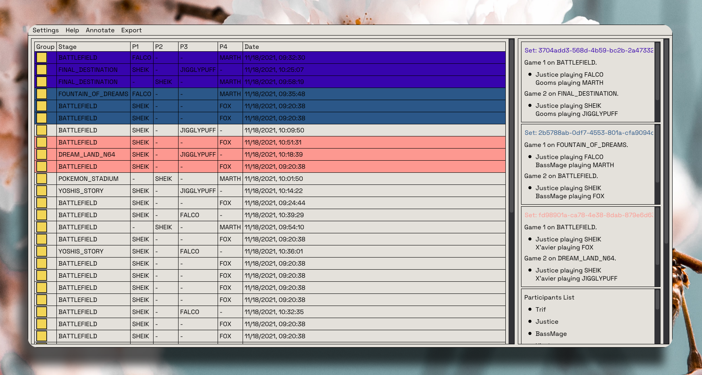

# Slippi Collection Utilities

Monorepo for some utilities that should make managing slippi files easier

---

## Slippi Labeler

During a tournament, use the Slippi Labeler to group games into sets. Label the players on each port

Automatically fetches a list of players from a Start.gg url. Then at the end, export the labels for record keeping or whatever you want!

---

## Slippi Export

Slippi Export: Take the annotated files and generate youtube videos complete with thumbnail, description and overlay.

---

#### TODO

##### Slippi Labeller

 - [x] Test the manual entry of values in the main screen (Completed 22-12-13)
 - [ ] Annotations file, which fields to keep, how to load it during startup?
 - [ ] Figure out reloading the UI when a new file is created 
 - [ ] Get all participants
 - [ ] Manual entry of participant should update participants list
 - [ ] Fix annotation with no check boxes
